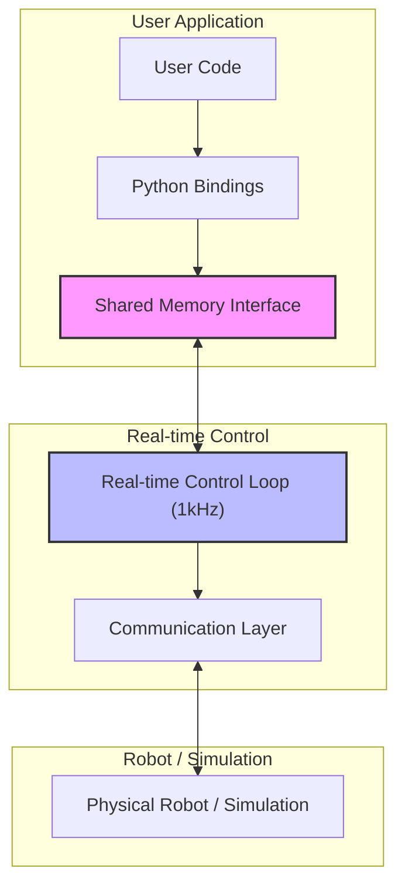

Python bindings for the Franka robot control library (libfranka) with real-time control capabilities and simulation support.

## Related Projects

- [franka-gym](https://github.com/BarisYazici/franka-gym) - A Gym environment for reinforcement learning with the Franka robot
- [libfranka-sim](https://github.com/BarisYazici/libfranka-sim) - The simulation backend for libfranka used by these Python bindings

## Key Features

### Real-time Control Interface

The franka_bindings package stands out from other Python robot control libraries by providing a true real-time control interface:

- **1kHz Control Loop**: Maintains deterministic timing critical for precise robot control
- **Shared Memory Architecture**: Enables efficient communication between user code and the real-time control loop
- **Lock-free Communication**: Ensures reliable robot control even if user code is non-deterministic

### Integrated Simulation Support

Test and develop your robot control code without physical hardware:

- **Drop-in Replacement**: The simulation implements the complete libfranka network protocol
- **Seamless Transition**: Same code works for both simulation and real robot
- **Visualization**: Optional 3D visualization of the robot's movements
- **Physics-based**: Accurate dynamics simulation using the Genesis physics engine

### Comprehensive Robot Control

Full access to the libfranka C++ library capabilities:

- Robot state monitoring
- Joint position control
- Joint velocity control
- Joint torque control
- Error handling and recovery

## Architecture

The real-time interface uses a shared memory architecture for efficient communication between the control loop and the robot:



### Key Components:

1. **User Code**: Your application that controls the robot
2. **Python Bindings**: The libfranka Python interface
3. **Shared Memory Interface**: High-performance, lock-free communication between user code and real-time control
4. **Real-time Control Loop**: 1kHz control loop that ensures deterministic timing
5. **Communication Layer**: Manages network communication with the robot
6. **Robot/Simulation**: Either the physical Franka robot or the libfranka_sim simulation

## Installation

### Prerequisites

- libfranka must be installed on your system
- Python 3.7 or later
- CMake 3.10 or later
- C++ compiler that supports C++17

### Installation Steps

1. Make sure libfranka is installed
2. Build and install the Python bindings:

```bash
# Navigate to the franka_bindings directory
cd python/franka_bindings

# Create a build directory
mkdir -p build
cd build

# Configure with CMake
cmake ..

# Build the bindings
make -j4

# Return to the franka_bindings directory
cd ..

# Install the Python package
pip install -e .
```

If CMake can't find libfranka, you may need to specify the Franka_DIR:

```bash
export Franka_DIR=/path/to/libfranka/build
```

Or directly in the CMake command:

```bash
cmake -DFranka_DIR=/path/to/libfranka/build ..
```

## Usage Guide

### Basic Usage

```python
from franka_bindings import Robot

# Connect to robot (use the robot's IP address)
robot = Robot("192.168.0.1")  # Use "127.0.0.1" for simulation

# Get robot state
robot.start_realtime_control()
rt_control = robot.get_realtime_control()
state = rt_control.get_current_state()
print(f"Joint positions: {state.q}")

# Stop robot
robot.stop()
```

### Using with Simulation

The libfranka_sim server provides a drop-in replacement for the real Franka robot.

#### Prerequisites for Simulation

Before starting the simulation, ensure you have:

1. Installed the simulation dependencies:
   ```bash
   # Navigate to the simulation directory
   cd simulation
   
   # Install the simulation package and its dependencies
   pip install -e .
   ```

2. Verified that Genesis simulation is properly installed (required for the physics simulation)

#### Starting the Simulation Server

1. Open a terminal window and navigate to the simulation directory:
   ```bash
   cd simulation
   ```

2. Start the simulation server with visualization:
   ```bash
   python3 run_server.py -v
   ```
   
   The `-v` flag enables visualization so you can see the robot moving in the simulation.

3. To run without visualization (useful for headless systems or faster performance):
   ```bash
   python3 run_server.py
   ```

#### Running Examples with Simulation

Once the simulation server is running, you can connect to it using the Python bindings:

```python
from franka_bindings import Robot

# Connect to the simulation
robot = Robot("127.0.0.1")

# The rest of your code remains the same as with a real robot
```

## Examples

The package includes several example scripts in the `examples/` directory:

- `active_control_example.py`: Shows how to use active control for direct joint control
- `motion_generator_example.py`: More complex motion generation
- `motion_control_example.py`: Real-time motion control example

### Example: Sinusoidal Joint Motion

```python
#!/usr/bin/env python3

import numpy as np
from franka_bindings import Robot, ControllerMode, JointPositions

def main():
    try:
        # Connect to robot (use "127.0.0.1" for simulation or the robot's IP for real hardware)
        robot = Robot("127.0.0.1")
        
        # Set collision behavior
        lower_torque_thresholds = [20.0] * 7  # Nm
        upper_torque_thresholds = [40.0] * 7  # Nm
        lower_force_thresholds = [10.0] * 6   # N (linear) and Nm (angular)
        upper_force_thresholds = [20.0] * 6   # N (linear) and Nm (angular)
        
        robot.set_collision_behavior(
            lower_torque_thresholds,
            upper_torque_thresholds,
            lower_force_thresholds,
            upper_force_thresholds
        )
        
        # Start joint position control
        control = robot.start_joint_position_control(ControllerMode.JointImpedance)
        
        # Get initial position
        state, duration = control.readOnce()
        initial_position = list(state.q)
        
        # Move the robot with a sinusoidal motion
        amplitude = np.pi / 8.0
        frequency = 0.4  # Hz
        run_time = 5.0  # seconds
        elapsed_time = 0.0
        
        while elapsed_time < run_time:
            state, duration = control.readOnce()
            elapsed_time += duration.to_sec()
            
            # Calculate desired position
            desired_position = initial_position.copy()
            delta_angle = amplitude * (1.0 - np.cos(2.0 * np.pi * frequency * elapsed_time))
            desired_position[3] += delta_angle  # Move joint 4
            
            # Send command
            joint_positions = JointPositions(desired_position)
            if elapsed_time >= run_time - 0.1:
                joint_positions.motion_finished = True
                
            control.writeOnce(joint_positions)
            
    except Exception as e:
        print(f"Error: {e}")
        robot.stop()

if __name__ == "__main__":
    main()
```

## Troubleshooting

If you encounter issues:

1. Make sure libfranka is properly installed
2. Check that the Franka_DIR environment variable is set correctly
3. Verify that the robot is connected and powered on
4. For simulation, ensure the simulation server is running

## License

`franka_bindings` is licensed under the [Apache 2.0 license][apache-2.0].